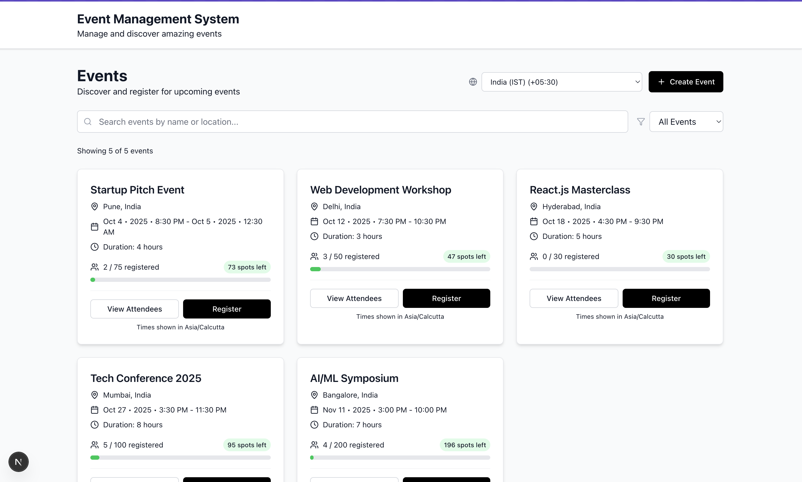
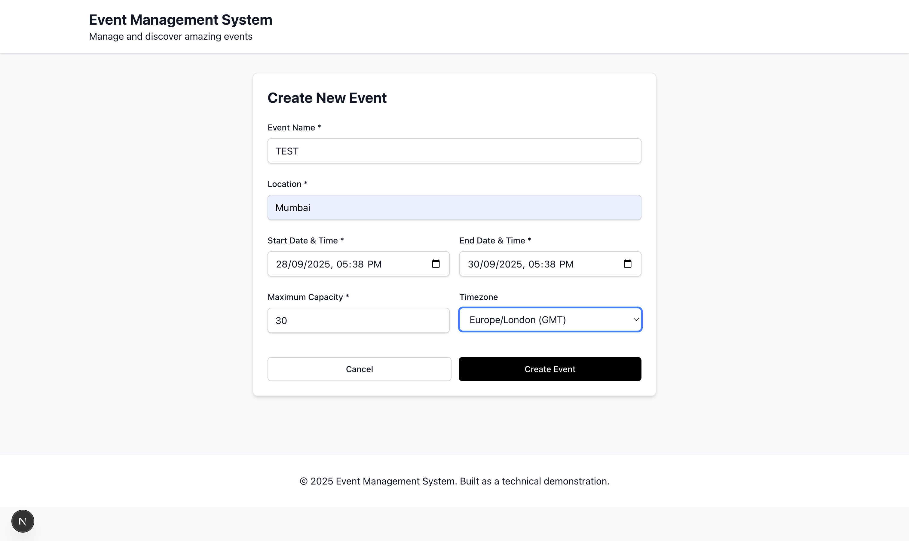
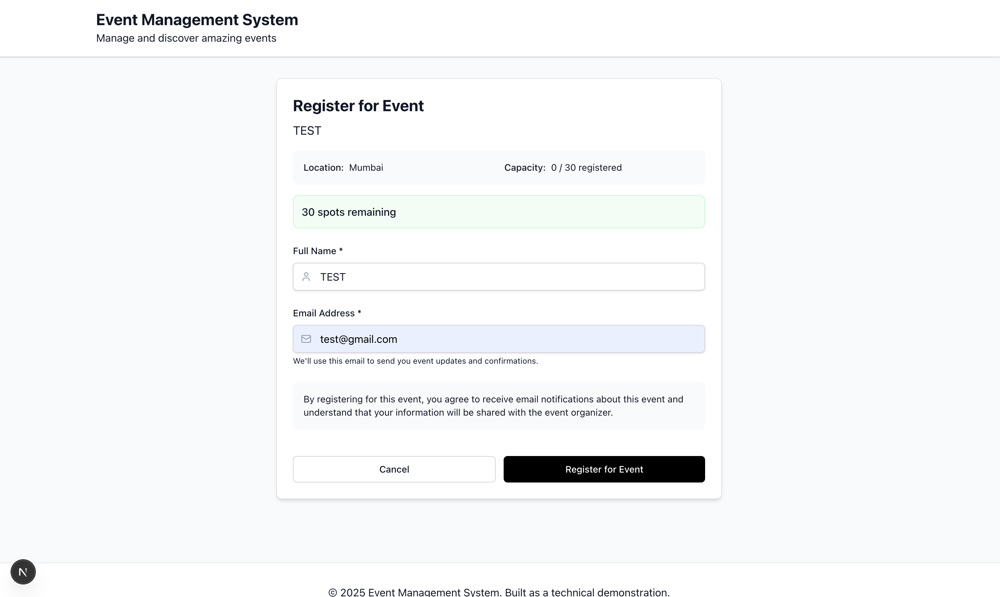
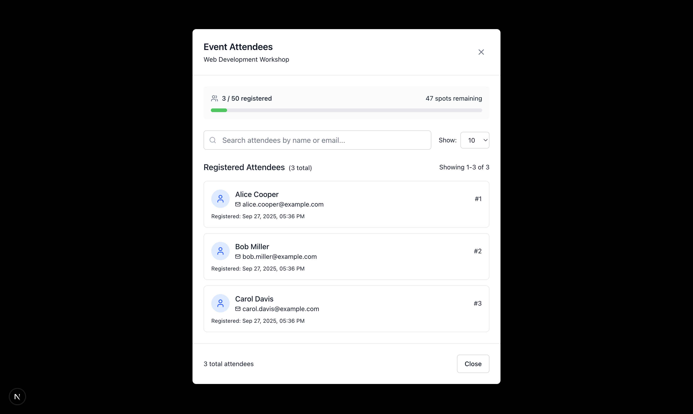

# Mini Event Management System

A full-stack event management application built with Laravel (Backend) and Next.js (Frontend).

## Table of Contents
- [Screenshots](#screenshots)
- [Features](#features)
- [Prerequisites](#prerequisites)
- [Installation](#installation)
- [API Endpoints](#api-endpoints)
- [Testing](#testing)
- [Deployment](#deployment)
- [Database Schema](#database-schema)

## Screenshots

### Frontend Application

#### Home Page - Event Listing


#### Event Details & Registration


#### Registration Form


#### Attendees Management


## Features

### Core Requirements
- **Event Creation**: Create events with name, location, start_time, end_time, max_capacity
- **Event Listing**: View all upcoming events with pagination
- **Attendee Registration**: Register attendees with name and email validation
- **Capacity Management**: Prevent overbooking (max_capacity enforcement)
- **Duplicate Prevention**: Prevent duplicate email registrations per event
- **Attendee Listing**: View all registered attendees for an event

### Additional Features
- Pagination on events and attendees lists
- Unit tests (70 tests, 398 assertions)
- Swagger/OpenAPI documentation
- Timezone management (IST support)
- Search functionality for attendees
- Event statistics and capacity tracking

## Prerequisites

- **PHP** >= 8.2
- **Composer** >= 2.0
- **Node.js** >= 18.0
- **npm** or **yarn**
- **SQLite** (included with PHP)

## Installation

### 1. Clone the Repository
```bash
git clone https://github.com/tiwaryash/omnify-assingmemt.git
cd omnify-assingmemt
```

### 2. Backend Setup (Laravel)
```bash
# Navigate to backend directory
cd event-management-system/backend

# Install PHP dependencies
composer install

# Copy environment file
cp .env.example .env

# Generate application key
php artisan key:generate

# Create SQLite database
touch database/database.sqlite

# Run database migrations
php artisan migrate

# Seed database with sample data (optional)
php artisan db:seed --class=SampleDataSeeder

# Generate Swagger documentation
php artisan l5-swagger:generate

# Start the Laravel development server
php artisan serve
```
Backend runs on: http://localhost:8000

### 3. Frontend Setup (Next.js)
```bash
# Navigate to frontend directory (in a new terminal)
cd event-management-system/frontend

# Install Node.js dependencies
npm install

# Start the Next.js development server
npm run dev
```
Frontend runs on: http://localhost:3000

### 4. Access Points
- **Frontend**: http://localhost:3000
- **Backend API**: http://localhost:8000/api
- **API Documentation**: http://localhost:8000/api/documentation
- **Health Check**: http://localhost:8000/api/health

## API Endpoints

### Events
- `GET /api/events` - Get all upcoming events
- `POST /api/events` - Create a new event
- `GET /api/events/{id}` - Get a specific event
- `PUT /api/events/{id}` - Update an event
- `DELETE /api/events/{id}` - Delete an event

### Attendees
- `POST /api/events/{eventId}/register` - Register for an event
- `GET /api/events/{eventId}/attendees` - Get event attendees
- `DELETE /api/events/{eventId}/attendees/{attendeeId}` - Remove attendee
- `GET /api/events/{eventId}/attendees/check/{email}` - Check registration status
- `GET /api/events/{eventId}/attendees/count` - Get attendee count

### Sample API Requests

#### Create an Event
```bash
curl -X POST "http://localhost:8000/api/events" \
  -H "Content-Type: application/json" \
  -d '{
    "name": "Tech Conference 2025",
    "location": "Mumbai, India",
    "start_time": "2025-12-01 10:00:00",
    "end_time": "2025-12-01 18:00:00",
    "max_capacity": 100,
    "timezone": "Asia/Kolkata"
  }'
```

#### Register Attendee
```bash
curl -X POST "http://localhost:8000/api/events/1/register" \
  -H "Content-Type: application/json" \
  -d '{
    "name": "John Doe",
    "email": "john@example.com"
  }'
```

#### Get Events
```bash
curl "http://localhost:8000/api/events"
```

#### Get Event Attendees
```bash
curl "http://localhost:8000/api/events/1/attendees"
```

## Testing

### Run All Tests
```bash
cd event-management-system/backend
php artisan test
```

### Run Specific Test Types
```bash
# Unit tests only
php artisan test --testsuite=Unit

# Feature tests only
php artisan test --testsuite=Feature

# Specific test class
php artisan test --filter EventServiceTest
```

### Test Coverage
- **Total Tests**: 70
- **Unit Tests**: 36 (EventService: 16, AttendeeService: 20)
- **Feature Tests**: 32 (EventController: 14, AttendeeController: 18)
- **Assertions**: 398

## Deployment

### Laravel Forge Deployment

1. Create account at [Laravel Forge](https://forge.laravel.com)
2. Connect your GitHub repository
3. Create new site and connect repository
4. Set environment variables:
   ```env
   APP_ENV=production
   APP_DEBUG=false
   APP_URL=https://your-domain.com
   DB_CONNECTION=sqlite
   DB_DATABASE=/home/forge/your-domain.com/database/database.sqlite
   ```

### Laravel Vapor (Serverless)

```bash
# Install Vapor CLI
composer global require laravel/vapor-cli

# Initialize Vapor
vapor init

# Deploy
vapor deploy production
```

### Manual Deployment

Use the provided deployment script:
```bash
# Make script executable
chmod +x laravel-deploy.sh

# Run deployment script
./laravel-deploy.sh
```

The script handles:
- Laravel optimization (config, route, view caching)
- Production dependency installation
- Database migrations
- File permissions
- API documentation generation

### Shared Hosting Deployment

1. **Prepare Laravel for production:**
```bash
cd event-management-system/backend
composer install --optimize-autoloader --no-dev
php artisan config:cache
php artisan route:cache
php artisan view:cache
```

2. **Upload structure:**
```
public_html/
├── .htaccess (from Laravel's public folder)
├── index.php (from Laravel's public folder)
└── laravel/ (all other Laravel files)
    ├── app/
    ├── bootstrap/
    ├── config/
    ├── database/
    ├── resources/
    ├── routes/
    ├── storage/
    └── vendor/
```

3. **Update index.php:**
```php
<?php
require __DIR__.'/laravel/vendor/autoload.php';
$app = require_once __DIR__.'/laravel/bootstrap/app.php';
```

### Frontend Deployment

Deploy to Vercel:
```bash
cd event-management-system/frontend
npm install -g vercel
vercel --prod
```

Set environment variable:
```env
NEXT_PUBLIC_API_URL=https://your-api-domain.com/api
```

### Production Environment

Copy `production.env.example` to `.env` and update:
```env
APP_NAME="Event Management System"
APP_ENV=production
APP_KEY=base64:your_generated_key
APP_DEBUG=false
APP_URL=https://your-domain.com
DB_CONNECTION=sqlite
DB_DATABASE=/app/database/database.sqlite
L5_SWAGGER_CONST_HOST=https://your-domain.com
```

## Database Schema

### Tables

#### Events Table
```sql
CREATE TABLE events (
    id INTEGER PRIMARY KEY AUTOINCREMENT,
    name VARCHAR(255) NOT NULL,
    location VARCHAR(255) NOT NULL,
    start_time DATETIME NOT NULL,
    end_time DATETIME NOT NULL,
    max_capacity INTEGER NOT NULL,
    current_attendees INTEGER DEFAULT 0,
    timezone VARCHAR(255) DEFAULT 'Asia/Kolkata',
    created_at DATETIME,
    updated_at DATETIME
);
```

#### Attendees Table
```sql
CREATE TABLE attendees (
    id INTEGER PRIMARY KEY AUTOINCREMENT,
    event_id INTEGER NOT NULL,
    name VARCHAR(255) NOT NULL,
    email VARCHAR(255) NOT NULL,
    created_at DATETIME,
    updated_at DATETIME,
    FOREIGN KEY (event_id) REFERENCES events(id) ON DELETE CASCADE,
    UNIQUE(event_id, email)
);
```

### Relationships
- One-to-Many: Event → Attendees
- Foreign key constraint with cascade delete
- Unique constraint on (event_id, email) prevents duplicate registrations

## Project Structure

```
event-management-system/
├── backend/ (Laravel API)
│   ├── app/
│   │   ├── Http/Controllers/Api/    # API Controllers
│   │   ├── Models/                  # Eloquent Models
│   │   ├── Services/                # Business Logic
│   │   └── Http/Requests/           # Form Validation
│   ├── database/
│   │   ├── migrations/              # Database Schema
│   │   ├── factories/               # Test Data Factories
│   │   └── seeders/                 # Sample Data
│   ├── tests/
│   │   ├── Unit/                    # Service Tests
│   │   └── Feature/                 # API Tests
│   └── routes/api.php               # API Routes
├── frontend/ (Next.js)
│   ├── src/
│   │   ├── app/                     # Next.js App Router
│   │   ├── components/              # React Components
│   │   └── lib/                     # API Client & Utils
│   └── public/                      # Static Assets
└── README.md
```

## Quick Start Commands

```bash
# Clone repository
git clone https://github.com/tiwaryash/omnify-assingmemt.git
cd omnify-assingmemt

# Backend setup
cd event-management-system/backend
composer install
cp .env.example .env
php artisan key:generate
touch database/database.sqlite
php artisan migrate
php artisan db:seed --class=SampleDataSeeder
php artisan l5-swagger:generate
php artisan serve

# Frontend setup (new terminal)
cd event-management-system/frontend
npm install
npm run dev

# Run tests
cd event-management-system/backend
php artisan test
```

Access the application at http://localhost:3000